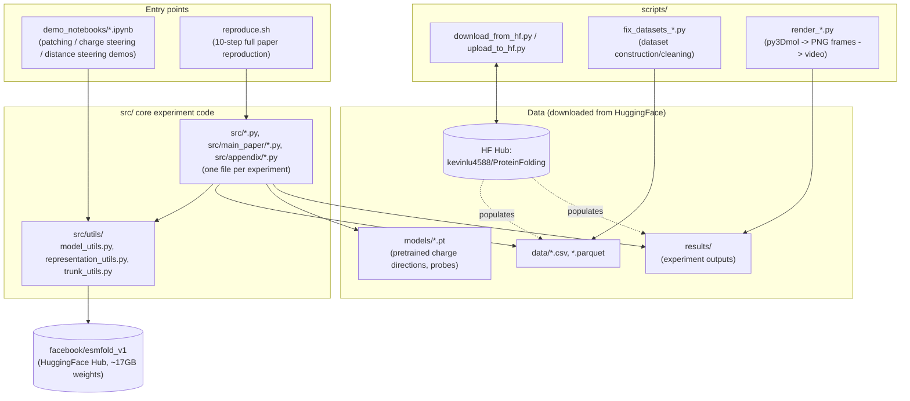
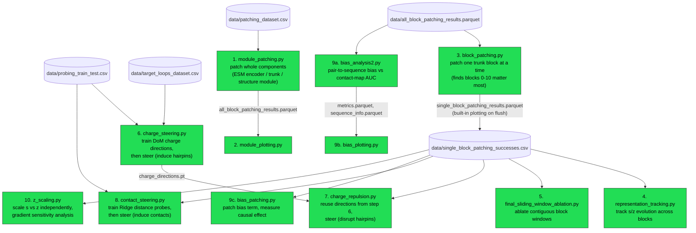
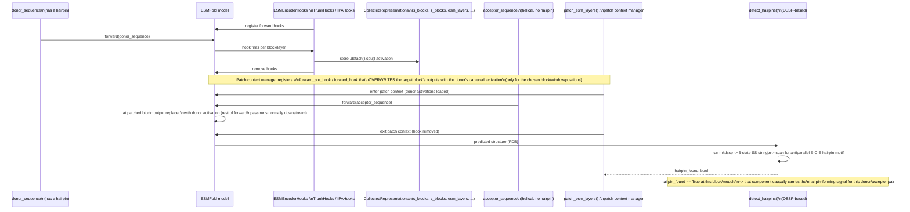
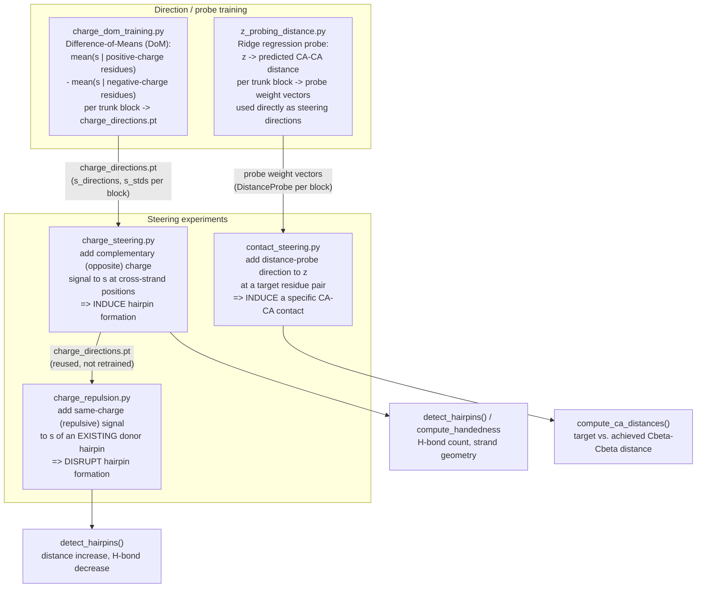
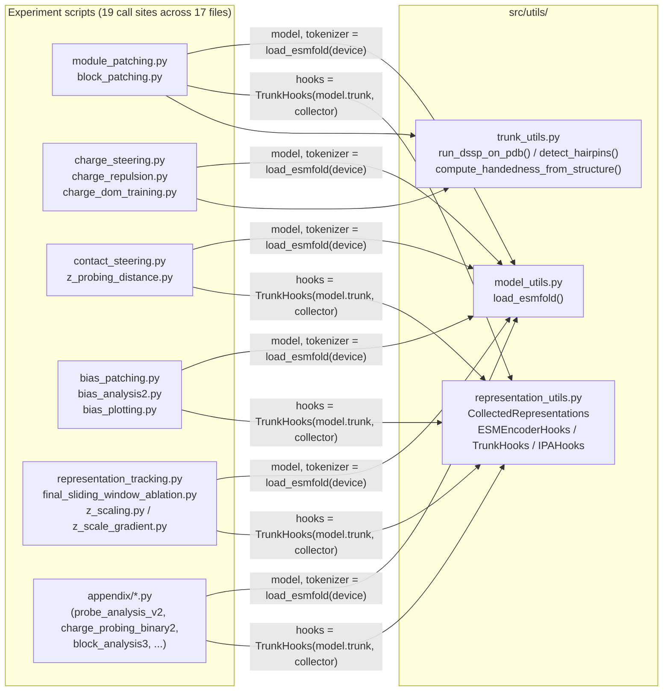
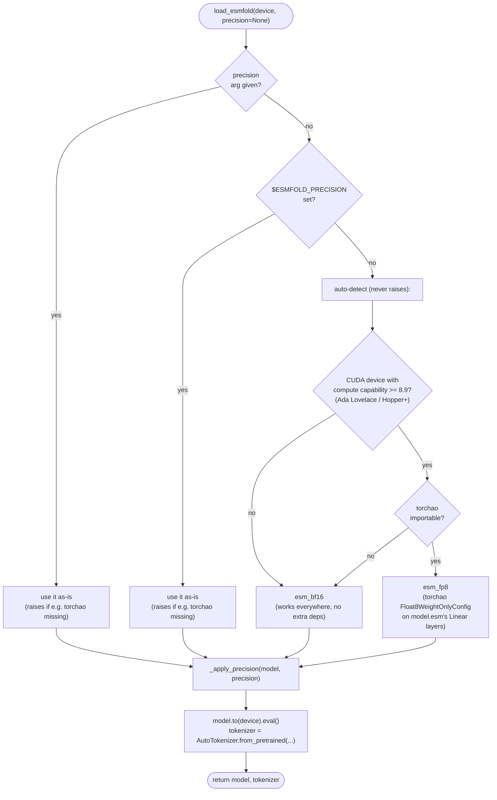

# Architecture Diagrams

Visual reference for how this repository's code is organized and how the core
experiments call into each other and into ESMFold itself. See
[`../README.md`](../README.md) for setup and [`../src/README.md`](../src/README.md)
for a per-module description of what each script does.

All diagrams are [Mermaid](https://mermaid.js.org/); GitHub renders them
inline automatically.

## Table of contents

1. [Repository overview](#1-repository-overview)
2. [ESMFold model internals](#2-esmfold-model-internals)
3. [`reproduce.sh` pipeline (10 steps)](#3-reproducesh-pipeline-10-steps)
4. [Core method A: activation patching](#4-core-method-a-activation-patching)
5. [Core method B: representation steering](#5-core-method-b-representation-steering)
6. [Shared utilities call graph](#6-shared-utilities-call-graph)
7. [Model loading / precision auto-detection](#7-model-loading--precision-auto-detection)

---

## 1. Repository overview

How the top-level pieces fit together: demo notebooks are the fast path (no
dataset download needed), `reproduce.sh` is the full paper-reproduction path,
and both ultimately load ESMFold through the same `src/utils/model_utils.py`
helper.

---

## 2. ESMFold model internals

Background needed to read every other diagram in this doc. All experiments
intervene on one of these three stages. `s` = per-residue ("sequence") state,
`z` = per-residue-pair ("pairwise") state.

```mermaid
flowchart LR
    seq["input sequence\n(amino acid string)"]

    subgraph encoder["ESM-2 encoder (model.esm)\n36 transformer layers, 2560-dim"]
        esmlayers["layer 0 ... layer 35"]
    end

    combine["esm_s_combine\n(learned softmax-weighted sum\nover all 37 layer outputs incl. embeddings)"]
    mlp["esm_s_mlp\n(2560 -> 1024)"]

    subgraph trunk["Folding trunk (model.trunk)\n48 blocks, recycled up to 4x"]
        direction TB
        block["block i:\nseq_attention (s update)\ntri_mul_in / tri_mul_out (z update)\ntri_att_start / tri_att_end (z update)\nsequence_to_pair / pair_to_sequence\n(cross-stream coupling)"]
    end

    subgraph sm["Structure module (model.trunk.structure_module)\n8 IPA blocks, shared weights"]
        ipa["Invariant Point Attention\n(s, z -> rigid frames -> backbone update)"]
    end

    heads["Output heads:\ndistogram_head, ptm_head, lddt_head, lm_head"]
    coords["3D coordinates (atom14/atom37)\n+ plddt, ptm, predicted_aligned_error"]

    seq --> encoder
    esmlayers -->|"hidden_states\n(all 37 layers)"| combine
    combine -->|"esm_s: [B,L,37,2560] -> [B,L,2560]"| mlp
    mlp -->|"s_s_0: [B,L,1024]"| trunk
    trunk -->|"z_0: [B,L,L,128]\n(initialized to zeros)"| trunk
    trunk -->|"s, z (recycled)"| sm
    sm -->|"s, z"| heads
    sm --> coords
    heads --> coords
```

Key facts used throughout the experiment code:

- The ESM-2 encoder dominates parameter count (~3B of ~3B+ params) -- this is
  why `src/utils/model_utils.py` only reduces precision on `model.esm`, not
  the trunk/structure module (see [§7](#7-model-loading--precision-auto-detection)).
- `s` and `z` are what activation patching, hooks, and steering all target.
- The trunk is **recycled**: it runs its 48 blocks, then feeds its own output
  back in as the next recycle's input (up to `num_recycles` times, default 4),
  refining the structure iteratively.

---

## 3. `reproduce.sh` pipeline (10 steps)

Each step is a standalone script (`python src/....py --args`); this diagram
shows the actual data dependencies between steps, i.e. which step's output
file feeds which later step's input. Case counts (`N_MODULE`, `N_BLOCK`, ...)
are configured at the top of `reproduce.sh`.

All steps share one model-loading call (`load_esmfold`, see [§7](#7-model-loading--precision-auto-detection))
and write into `results/<step_name>/`.

---

## 4. Core method A: activation patching

The central causal-tracing technique (`module_patching.py`, `block_patching.py`,
and the patching parts of `bias_patching.py` / `representation_tracking.py`).
A **donor** sequence (known to form a hairpin) and an **acceptor** sequence
(helical, no hairpin) are each run through the model; the donor's activations
at a chosen location are spliced into the acceptor's forward pass to test
whether that location causally carries the hairpin-forming signal.

`module_patching.py` patches whole components (swap all 36 ESM layers, or all
48 trunk blocks, or the whole structure module at once) to find *which
component* is necessary/sufficient. `block_patching.py` repeats this one trunk
block at a time to find *which of the 48 blocks* matter (the paper's headline
finding: blocks 0-10 have the strongest causal effect).

---

## 5. Core method B: representation steering

Instead of copying a donor's raw activations (method A), steering *adds a
learned direction vector* to `s` or `z` at chosen blocks/positions, then
checks the effect on the predicted structure. Two direction-learning methods
feed three steering experiments:

All three steering scripts share the same intervention mechanism: monkey-patch
`model.trunk.blocks[i].forward` (via `types.MethodType`) to add the direction
vector to `s` or `z` right after the block computes it, for a chosen window of
blocks and a chosen window of sequence positions, scaled by a magnitude in
units of the direction's standard deviation.

---

## 6. Shared utilities call graph

`src/utils/` has no dependency on any experiment script (arrows only point
*into* it), so every experiment script can freely import from it.

Most experiment scripts additionally define their **own** local, simplified
copies of the hook classes (e.g. `module_patching.py` has its own
`ESMEncoderHooks`) rather than importing from `representation_utils.py`, to
keep each script's core collection logic self-contained -- see the code
comments in each file's "PART 2: HOOK MANAGERS" section for the specifics of
what each local copy collects.

---

## 7. Model loading / precision auto-detection

`load_esmfold()` (`src/utils/model_utils.py`) is the single entry point every
experiment script uses to load `facebook/esmfold_v1`. Only `model.esm` (the
ESM-2 backbone) is ever put in reduced precision -- the trunk and structure
module always stay fp32, because `modeling_esmfold.py` upcasts the backbone's
output back to fp32 immediately (`esm_s = esm_s.to(self.esm_s_combine.dtype)`),
so this keeps every hook-captured `s`/`z`/`plddt` tensor `.numpy()`-safe for
the sklearn/plotting code used throughout this repo.

Benchmarked on an RTX 4090 Laptop (16GB VRAM), 102-residue sequence, fp32
baseline = 14.4GB peak / mean pLDDT 0.6148:

| precision | peak VRAM | mean pLDDT (delta) | extra deps |
|---|---|---|---|
| `fp32` | 14.4 GB | 0.6148 (baseline) | -- |
| `esm_half` | 8.6 GB | 0.6145 (-0.0003) | -- |
| `esm_bf16` | 8.6 GB | 0.6164 (+0.0016) | -- |
| `esm_fp8` | 6.0 GB | 0.6139 (-0.0009) | `torchao` |

See the `src/utils/model_utils.py` module docstring for the full rationale
(including why whole-model `bf16`/`half` conversion was rejected -- it breaks
`.numpy()` on hook-captured tensors and, for `half`, crashes `compute_tm`
outright from fp16 overflow).
